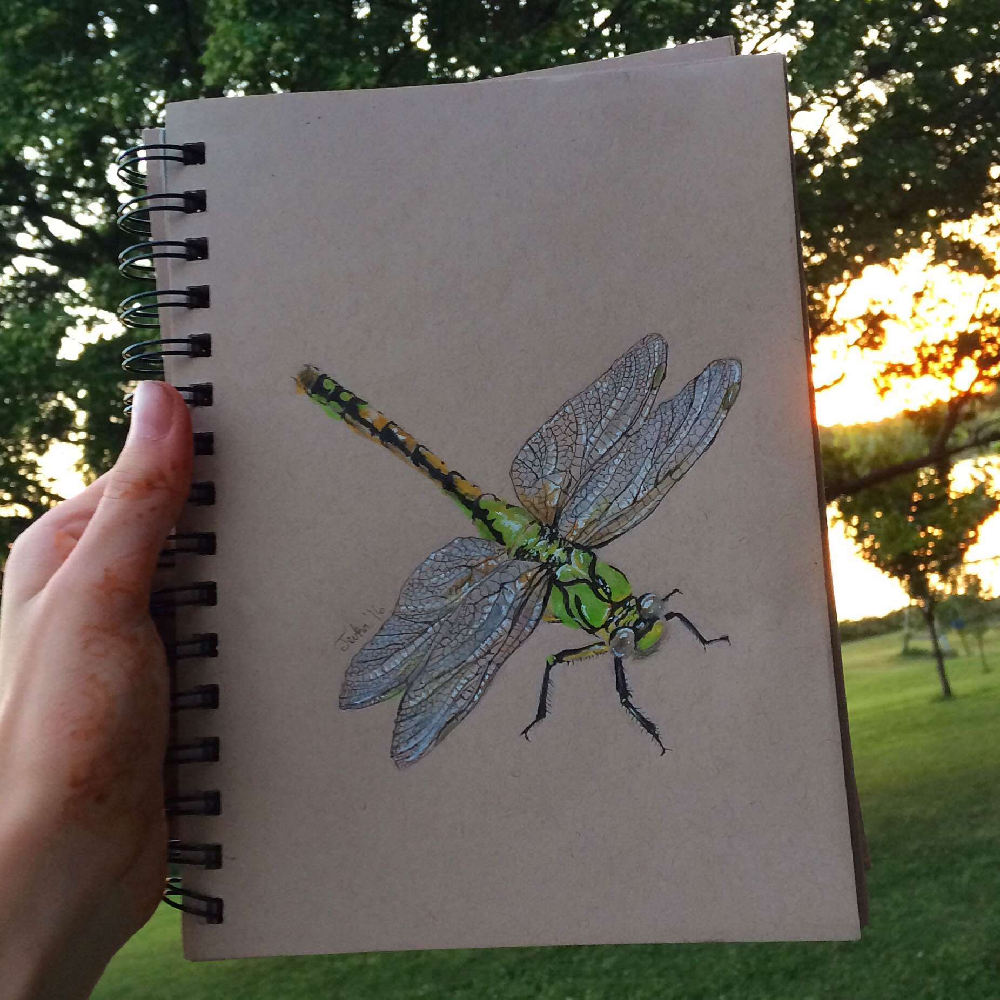

#Tevka's Dragonfly
####UNDER RECONSTRUCTION
I had published a finished version elsewhere, but decided to move it for the sake of uncluttering an ever-growing style file. 
I am also using this to practice using my own grid system. Useless and pointless to make one in a tutorial and then never use it. 
That's my story, and I'm sticking with it.

##Who is Tevka and why do I care?
She is a friend's daughter who has taught herself to draw. I drove her from TX to IA, and she dazzled me with her drawing. She had not really met me (baby and very early childhood do not count), and she was stuck with this old woman for a few days. We toured Austin, found the only place to serve waffles without chicken (please move on from that), and then took a roadtrip to her home in IA. 

I am fascinated by her style. She used her phone to find images and refer to them. Rarely used her thumbs except to hold the phone in her left hand while she drew with her right. Without any training, she saw what many miss (in this drawing, I'm thinking about the play of light on the wings and carapace). I wanted to use her drawings as backdrops to code I'm playing with. When I did this, I was practicing hidden buttons and changing their shape to fit the wings, head, thorax, abdomen.  

##What I practice with this exercise
####DIY grid system
####Hidden buttons
####Creating odd button shapes with CSS

##The Dragonfly she did in two days:

##Linky Doodle Doos:
##### [Tevka's Dragonfly on Surge](tevkas-dragonfly.surge.sh)

##### [My Codepen grid system](http://codepen.io/ihatetoast/pen/NRVvxq)